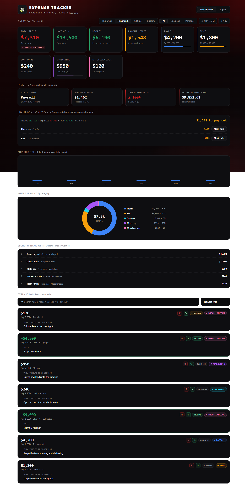
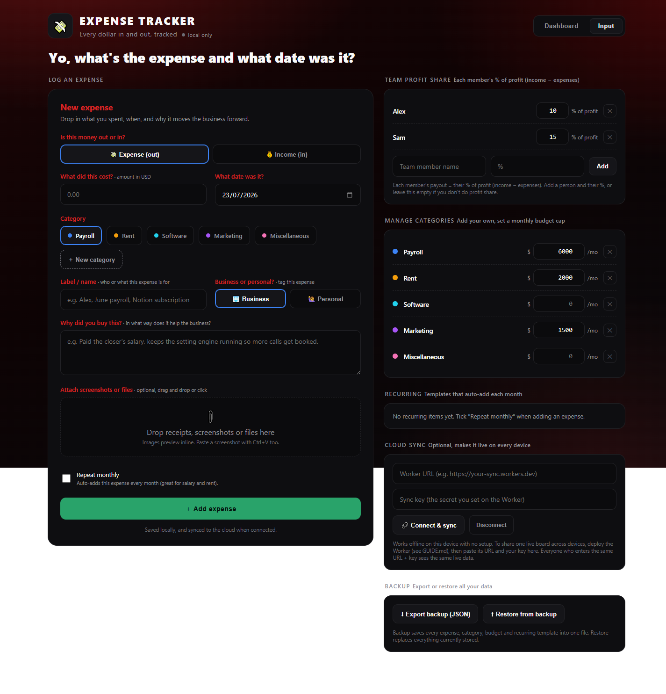
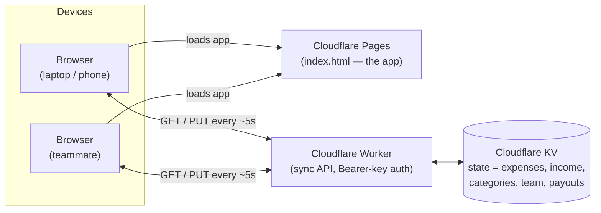

# Expense Tracker


[](https://github.com/jessxdavid/growthinitiative-expense-tracker/actions/workflows/validate.yml)

### 🔗 [Live demo → gi-expense-demo.pages.dev](https://gi-expense-demo.pages.dev/?demo)

A clean, single-file expense + income tracker with automatic team profit-share, categories, budgets, recurring items, attachments, insights, PDF/CSV export, and optional live cloud sync across devices. Runs at **$0** on Cloudflare (or open the file locally with no setup at all).

This is a **blank template** — no data, no accounts, nothing pre-filled. Clone it, brand it, deploy it (optional), and hand it to a client.

---

## Screenshots

**Dashboard** — totals, profit, payouts owed, monthly trend, category breakdown, and the expense/income log.



**Input** — log an expense or income, manage categories/budgets, and set the team profit-share.



> Sample data shown for illustration. Fresh clones start blank.

---

## What it does

- **Log expenses and income** in one place (toggle Expense / Income on the Input tab).
- **Auto profit-share:** Profit = Income − Expenses. Each team member you add gets their set % of profit, worked out automatically. Mark each person paid; see what's still owed.
- **Custom categories** with optional monthly **budget caps** (tile turns red when over).
- **Business / Personal** tag on every entry, filterable.
- **Recurring** items that auto-add each month (payroll, rent, subscriptions).
- **Attachments:** drag-drop or paste (Ctrl+V) receipts/screenshots; they preview inline.
- **Dashboard:** Total Spent · Income In · Profit · Payouts Owed tiles, monthly trend, category donut, spend-by-name, insights, searchable/sortable log.
- **Date ranges:** This week · This month · All time · Custom.
- **Export:** one-click **CSV** and a clean **PDF report**. Full **JSON backup / restore**.
- **Live sync (optional):** connect a tiny Cloudflare Worker and every device that enters the same URL + key shares one live board (updates every ~5s).

---

## Two ways to run it

### 1. Local only (zero setup)
Just open `index.html` in a browser. Everything works and saves to that browser. Nothing to install, nothing to pay. Good for one person on one machine.

### 2. Hosted + live across devices (still $0)
Deploy the page to Cloudflare Pages and the sync backend (Worker + KV) so a whole team shares one live link. Full step-by-step in **[GUIDE.md](GUIDE.md)**.

---

## Files

| File | What it is |
|------|-----------|
| `index.html` | The entire app (HTML + CSS + JS, no build step). |
| `worker.js` | The optional cloud-sync backend (Cloudflare Worker + KV). |
| `wrangler.toml` | Config for deploying the Worker. |
| `GUIDE.md` | Complete how-to-use + deploy guide. |
| `README.md` | This file. |

---

## Quick start

### Easiest — no git, no coding (for anyone)
1. Go to the repo: **https://github.com/jessxdavid/growthinitiative-expense-tracker**
2. Click the green **`< > Code`** button → **Download ZIP**.
3. **Unzip** the downloaded file.
4. Open the unzipped folder and **double-click `index.html`**.
5. It opens in your browser and works right away. Start logging expenses.

That's the whole thing for personal / single-computer use. Data saves in that browser. To share it as a live link across a team, follow **[GUIDE.md](GUIDE.md) → Part 2**.

### With git (for developers)
```bash
git clone https://github.com/jessxdavid/growthinitiative-expense-tracker.git
cd growthinitiative-expense-tracker
```
Then double-click `index.html`, or follow **[GUIDE.md](GUIDE.md)** to host it and turn on live sync.

> Heads-up: GitHub only **stores** the files — the repo link itself is not a working website. You either open `index.html` on your computer, or deploy it once (GUIDE.md Part 2) to get a shareable link.

---

## Architecture

One static file for the UI, one Worker for sync, one KV store for data. No server, no database to manage.



Local-only mode skips the Worker entirely — data lives in the browser's `localStorage`. Turn on cloud sync and every device sharing the same Worker URL + key sees one live board.

---

## Built with

| Layer | Tech |
|-------|------|
| Frontend | Vanilla **HTML5 · CSS3 · JavaScript** — no framework, single file, zero build step |
| Backend (sync) | **Cloudflare Workers** + **KV** |
| Hosting | **Cloudflare Pages** |
| Tooling | **VS Code** · **Git** · **GitHub** · **Wrangler** (Cloudflare CLI) |
| Cost | **$0/mo** on Cloudflare's free tier |

Design goals: no dependencies, no build pipeline, no database server — one HTML file and one Worker, so it's trivial to fork, rebrand, and deploy for each client.

---

## Roadmap ideas

- Multi-currency support
- Role-based access (view-only vs editor)
- Automatic weekly payout reminders
- Per-client theming presets

---

## Contributors

Built and maintained by **[@jessxdavid](https://github.com/jessxdavid)** — Growth Initiative.

[](https://github.com/jessxdavid/growthinitiative-expense-tracker/graphs/contributors)

Contributions welcome — open an issue or a pull request.

---

## Notes

- Data lives in the browser (`localStorage`) until you connect cloud sync.
- Cloud sync is protected by a secret key you choose. Anyone with the **link + key** can view/edit — it's a shared team tool, not a login system.
- 100% static + one Worker. No database server, no monthly bill on Cloudflare's free tier.

## License

MIT — see [LICENSE](LICENSE). Free to use, modify, and deploy for your clients.
